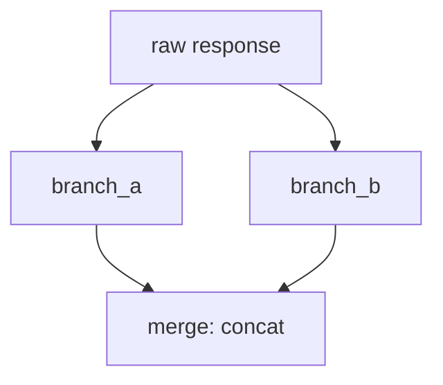
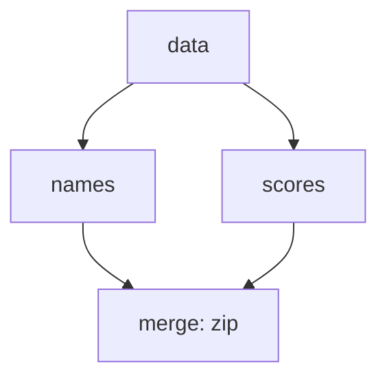
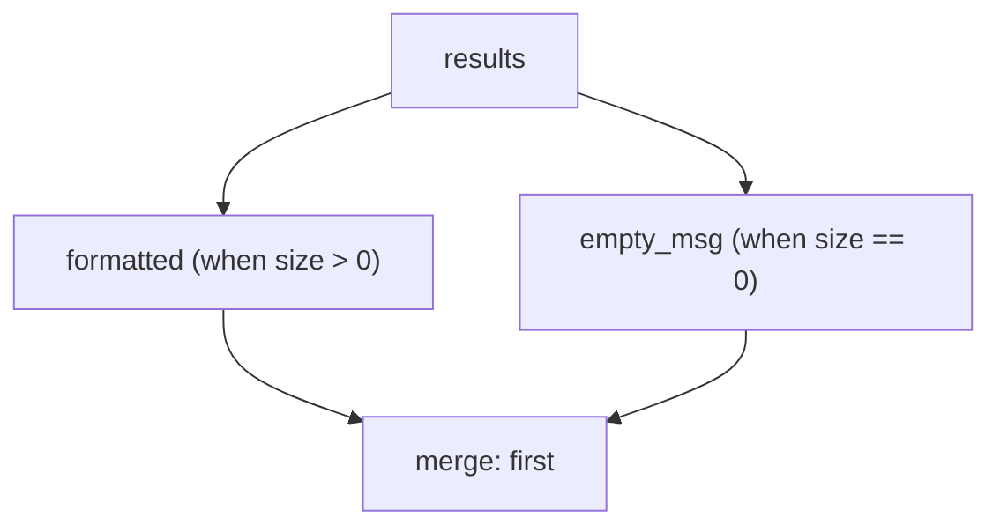
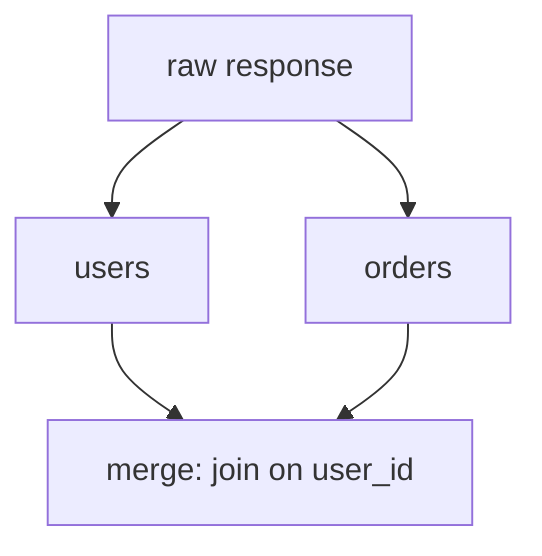
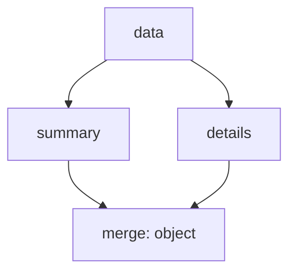
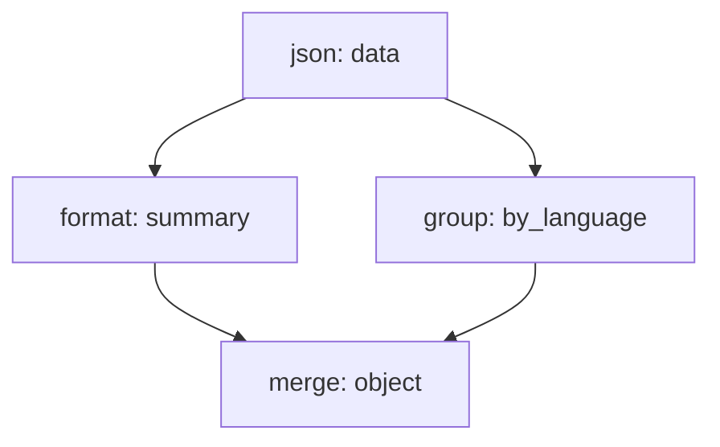
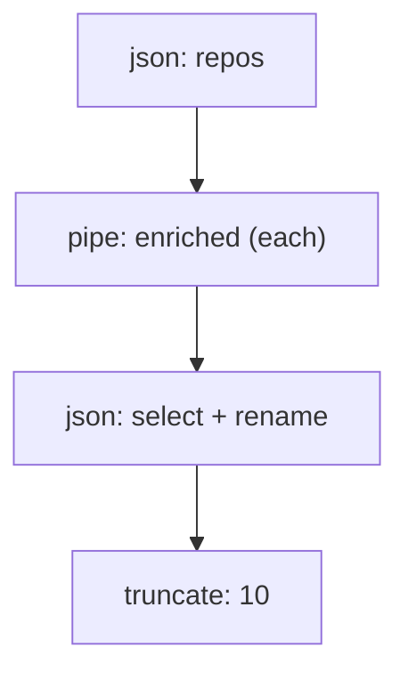
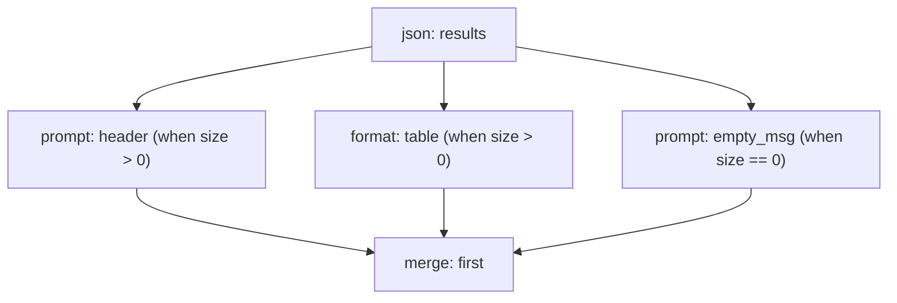
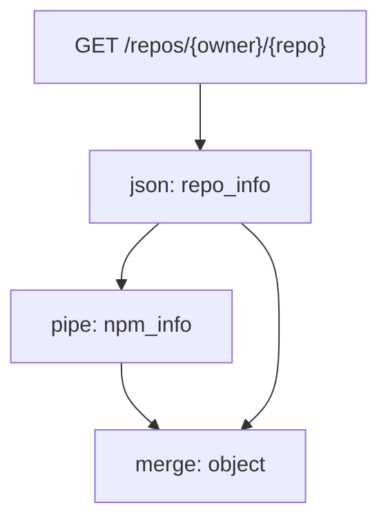
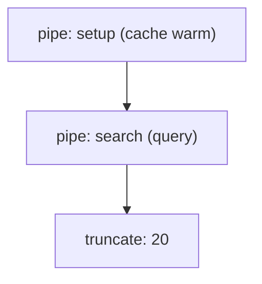

# DAG Transform Guide

Deep dive into DAG (Directed Acyclic Graph) transforms. Covers when to use DAGs, step fields, merge strategies, patterns with diagrams, testing, error handling, and memory considerations.

For the basics and all transform types, see the [Transform Guide](transforms.md).

All examples use spec 1.0 format.

---

## When to Use DAGs vs Linear Pipelines

Linear pipelines (A -> B -> C) handle most use cases. Each step takes the output of the previous step as input.

```yaml
# Linear: good for sequential processing
transform:
  - type: json
    extract: "$.items"
  - type: sort
    field: stars
    order: desc
  - type: truncate
    max_items: 10
```

Use DAGs when you need:

| Need | Linear pipeline | DAG |
|------|----------------|-----|
| Sequential processing | Yes | Overkill |
| Two transforms on the same data in parallel | No | Yes |
| Conditional branches (run A or B based on data) | No | Yes |
| Fan-out (apply a transform to each item) | No | Yes |
| Calling multiple tools and merging results | No | Yes |
| Ordering without data dependency | No | Yes |

If your pipeline is A -> B -> C with no branching, do not use DAGs. Keep it linear.

---

## Step Fields

Any transform step can have these optional DAG fields. Steps without DAG fields run in linear order, exactly like a regular pipeline. You can mix linear and DAG steps.

| Field | Type | Default | Description |
|-------|------|---------|-------------|
| `id` | string | - | Name for this step's output. Required for DAG steps that other steps reference. |
| `input` | string | previous step / `_root` | Which step's output to read from. Use step `id` values. `_root` reads the raw response. |
| `depends` | list | - | Steps that must complete first (ordering without data flow). |
| `each` | bool | `false` | Fan-out: iterate over input array, run the step once per item. |
| `when` | string | - | Condition expression. Step only runs if true. |
| `concurrency` | int | 10 | Max parallel goroutines for `each`. |

### id

Names the step so other steps can reference it. Required for any step that feeds into another DAG step.

```yaml
- id: data
  type: json
  extract: "$.items"
```

### input

Specifies which step's output this step reads. Without `input`, the step reads from the previous step (linear mode) or `_root` (when using `depends` without `input`).

```yaml
- id: data
  type: json
  extract: "$.items"

- id: summary
  input: data
  type: format
  template: "- {name}: {stars} stars"
```

### depends

Ordering constraint without data flow. The step waits for the listed steps to complete but reads its own input independently.

```yaml
- id: warmup
  type: pipe
  run: "cache warm --key results"

- id: query
  type: pipe
  run: "database query --sql 'SELECT * FROM results'"
  depends: [warmup]
```

`query` waits for `warmup` to finish but reads from `_root`, not from `warmup`'s output.

### each

Fan-out over an array. The step runs once per item, with each execution receiving a single element. Results are collected back into an array.

```yaml
- id: repos
  type: json
  extract: "$.items"

- id: enriched
  input: repos
  type: pipe
  run: "github get_repo --owner {owner} --repo {name}"
  each: true
  concurrency: 5
```

### when

Conditional execution. The step only runs when the expression evaluates to true. If the condition is false, the step produces null output.

```yaml
- id: formatted
  input: results
  type: format
  template: "- {name}"
  when: "size(data) > 0"
```

### concurrency

Limits parallel execution for `each` steps. Default is 10. Set lower for rate-limited APIs.

```yaml
- id: enriched
  input: repos
  type: pipe
  run: "github get_repo --owner {owner} --repo {name}"
  each: true
  concurrency: 3
```

---

## Merge Strategies

The `merge` type combines outputs from multiple branches into a single result.

```yaml
- type: merge
  sources: [branch_a, branch_b]
  strategy: concat
```

### concat (default)

Concatenate arrays into one flat array.

```yaml
- type: merge
  sources: [branch_a, branch_b]
  strategy: concat
```

**Input:** `[1, 2]` + `[3, 4]`
**Output:** `[1, 2, 3, 4]`



Use when: combining results from multiple API calls or parallel processing branches into one list.

### zip

Pair elements by index. Both inputs must have the same length.

```yaml
- type: merge
  sources: [names, scores]
  strategy: zip
```

**Input:** `["Alice", "Bob"]` + `[95, 87]`
**Output:** `[["Alice", 95], ["Bob", 87]]`



Use when: matching original items with enrichment data, pairing labels with values.

### first

Return the first non-null source. Designed for conditional branches where exactly one branch produces output.

```yaml
- type: merge
  sources: [formatted, empty_msg]
  strategy: first
```



Use when: one branch runs when data exists, another branch runs when data is empty.

### join

Merge objects from two sources by a shared key, similar to a SQL JOIN.

```yaml
- type: merge
  sources: [users, orders]
  strategy: join
  join_on: user_id
```

**Input:**
```json
[{"user_id": 1, "name": "Alice"}]
```
```json
[{"user_id": 1, "total": 250}]
```

**Output:**
```json
[{"user_id": 1, "name": "Alice", "total": 250}]
```



Use when: enriching records from a second data source. Fields from the second source are merged into matching records from the first.

### object

Combine into one map keyed by source ID. Each source's output becomes a named field.

```yaml
- type: merge
  sources: [summary, details]
  strategy: object
```

**Output:**
```json
{
  "summary": ["repo-a: 100 stars", "repo-b: 50 stars"],
  "details": {"Go": 3, "Rust": 2}
}
```



Use when: returning structured output with named sections. Good for dashboard-style results.

---

## Patterns

### Parallel branches

Process the same data two different ways, then merge.

```yaml
transform:
  - id: data
    type: json
    extract: "$.items"
    select: [full_name, description, language, stargazers_count]

  - id: summary
    input: data
    type: format
    template: "- {full_name}: {stargazers_count} stars"

  - id: by_language
    input: data
    type: group
    field: language

  - type: merge
    sources: [summary, by_language]
    strategy: object
```



The DAG executor detects that `summary` and `by_language` are independent (both depend only on `data`) and runs them in parallel.

### Fan-out with enrichment

Apply a transform to every item in an array concurrently. Common for calling another tool per item.

```yaml
transform:
  - id: repos
    type: json
    extract: "$.items"
    select: [full_name, owner, name]

  - id: enriched
    input: repos
    type: pipe
    run: "github get_repo --owner {owner.login} --repo {name}"
    each: true
    concurrency: 5

  - type: json
    input: enriched
    select: [full_name, description, stargazers_count, open_issues_count]
    rename:
      stargazers_count: stars
      open_issues_count: issues

  - type: truncate
    max_items: 10
```



With `each: true`, the pipe step receives each array element individually. `concurrency: 5` limits parallel API calls to avoid rate limits.

### Conditional branches

Run different transforms depending on the data. Use `when` to gate each branch, then `merge` with `strategy: first`.

```yaml
transform:
  - id: results
    type: json
    extract: "$.items"

  - id: table
    input: results
    type: format
    template: "| {full_name} | {language} | {stars} |"
    when: "size(data) > 0"

  - id: header
    type: prompt
    value: "| Repo | Language | Stars |\n|------|----------|-------|\n"
    when: "size(data) > 0"
    depends: [results]

  - id: empty_msg
    type: prompt
    value: "No repositories found. Try a broader search query."
    when: "size(data) == 0"
    depends: [results]

  - type: merge
    sources: [header, table, empty_msg]
    strategy: first
```



Only one branch produces output. `first` returns whichever is non-null.

### When expressions reference

| Expression | Description |
|-----------|-------------|
| `size(data) == N` | Array/map/string length equals N |
| `size(data) > N` | Length greater than N |
| `size(data) < N` | Length less than N |
| `size(data) >= N` | Length greater than or equal to N |
| `size(data) <= N` | Length less than or equal to N |
| `data.field == 'value'` | Field string comparison |
| `data.field != 'value'` | Field not-equal comparison |
| `data.field > N` | Numeric field comparison |

### Multi-tool composite

A complete example calling multiple tools and merging the results.

```yaml
spec: "1.0"
name: project-overview
namespace: community
description: Get a project overview from GitHub and npm
version: "1.0"
category: developer
tags: [github, npm, composite]

depends:
  - github
  - npm-registry

server:
  type: http
  url: https://api.github.com

auth:
  env: GITHUB_TOKEN
  header: Authorization
  value: "Bearer ${GITHUB_TOKEN}"

actions:
  - name: overview
    description: Get repo info and npm package details for a project
    path: /repos/{owner}/{repo}
    params:
      - name: owner
        required: true
      - name: repo
        required: true
    transform:
      - id: repo_info
        type: json
        select: [full_name, description, stargazers_count, open_issues_count, language]
        rename:
          stargazers_count: stars
          open_issues_count: issues

      - id: npm_info
        type: pipe
        run: "npm-registry info --package {repo}"
        depends: [repo_info]

      - type: merge
        sources: [repo_info, npm_info]
        strategy: object
```



### Ordering without data flow

Use `depends` when a step must wait for another to complete but reads its own input.

```yaml
transform:
  - id: setup
    type: pipe
    run: "cache warm --key search-results"

  - id: search
    type: pipe
    run: "database query --sql 'SELECT * FROM search_results LIMIT 50'"
    depends: [setup]

  - type: truncate
    input: search
    max_items: 20
```



`search` waits for `setup` to finish but reads from `_root`, not from `setup`'s output.

---

## Testing with --visualize

Use `--visualize` to see the DAG structure without executing it.

```bash
clictl transform --file my-spec.yaml --action search --visualize
```

Output:

```
DAG structure for action "search":
  data (json) -> summary (format)
  data (json) -> by_language (group)
  summary (format) -> merge
  by_language (group) -> merge

Parallelizable: [summary, by_language]
Linear tail: [merge]
```

This shows which steps run in parallel and the execution order. Use it to verify your DAG is structured correctly before testing with real data.

To test with sample data:

```bash
clictl transform --file my-spec.yaml --action search --input sample.json
```

This runs the transform pipeline against the sample JSON file without making a real API call.

---

## Error Handling

### Partial results

When a step in a DAG fails, clictl handles it based on the context:

| Scenario | Behavior |
|----------|----------|
| `each` step: one item fails | Failed item is null in the output array. Other items succeed. |
| Branch step fails | Branch output is null. Merge sees null for that source. |
| `when` is false | Step output is null (not an error). |
| `depends` step fails | Dependent step does not run. Error propagates. |
| `merge` with null source | Depends on strategy. `first` skips nulls. `concat` ignores null branches. `object` includes null value. |

### Error propagation

Errors propagate through data flow edges. If step A fails and step B reads from A (`input: A`), step B does not run. If step B only has `depends: [A]`, it also does not run.

Steps that are independent of the failed step continue to execute.

```yaml
transform:
  - id: data
    type: json
    extract: "$.items"

  - id: branch_a
    input: data
    type: pipe
    run: "tool_a process"

  - id: branch_b
    input: data
    type: pipe
    run: "tool_b process"

  - type: merge
    sources: [branch_a, branch_b]
    strategy: object
```

If `branch_a` fails, `branch_b` still runs. The merge result will have `{"branch_a": null, "branch_b": [...]}`.

### Timeouts

Each step inherits the server timeout. For `each` steps with many items, the total time is bounded by `concurrency` and per-item timeout. If a single item takes too long, it times out individually without blocking other items.

---

## Memory Considerations

Agent context windows are finite. DAGs can amplify data volume when branches process the same data differently or when `each` multiplies items. Keep these guidelines in mind.

### Truncate before fan-out

If the input array has 100 items and you fan-out with `each`, you get 100 parallel executions. Truncate the array first.

```yaml
# Good: limit before fan-out
- id: repos
  type: json
  extract: "$.items"

- id: top_repos
  input: repos
  type: truncate
  max_items: 10

- id: enriched
  input: top_repos
  type: pipe
  run: "github get_repo --owner {owner.login} --repo {name}"
  each: true
```

```yaml
# Risky: fan-out on unbounded array
- id: repos
  type: json
  extract: "$.items"

- id: enriched
  input: repos
  type: pipe
  run: "github get_repo --owner {owner.login} --repo {name}"
  each: true
```

### Truncate after merge

Merging two branches can double the data. Add a truncate step after the merge.

```yaml
- type: merge
  sources: [branch_a, branch_b]
  strategy: concat

- type: truncate
  max_items: 20
```

### Select fields early

Extract only the fields you need in the first step. Carrying unused fields through the DAG wastes memory and tokens.

```yaml
# Good: select early
- id: data
  type: json
  extract: "$.items"
  select: [full_name, language, stargazers_count]

# Wasteful: carry all 30+ fields through the DAG
- id: data
  type: json
  extract: "$.items"
```

### Keep concurrency reasonable

High concurrency on `each` steps means many parallel results held in memory. The default of 10 is a good balance. Lower it for large payloads.

```yaml
# Large payloads: lower concurrency
- id: enriched
  input: repos
  type: pipe
  run: "github get_repo --owner {owner.login} --repo {name}"
  each: true
  concurrency: 3

# Small payloads: default is fine
- id: enriched
  input: repos
  type: pipe
  run: "github get_tag --repo {name}"
  each: true
```

---

## Quick Reference

### Step fields

| Field | Required | Default | Description |
|-------|----------|---------|-------------|
| `id` | For referenced steps | - | Step name |
| `input` | No | previous / `_root` | Data source |
| `depends` | No | - | Ordering constraint |
| `each` | No | `false` | Fan-out |
| `when` | No | - | Conditional |
| `concurrency` | No | `10` | Parallel limit for `each` |

### Merge strategies

| Strategy | Input | Output |
|----------|-------|--------|
| `concat` | `[1,2]` + `[3,4]` | `[1,2,3,4]` |
| `zip` | `["a","b"]` + `[1,2]` | `[["a",1],["b",2]]` |
| `first` | `null` + `[1,2]` | `[1,2]` |
| `join` | `[{id:1,name:"A"}]` + `[{id:1,v:10}]` | `[{id:1,name:"A",v:10}]` |
| `object` | source_a + source_b | `{source_a:[...], source_b:[...]}` |

### Checklist

- [ ] Truncate before fan-out
- [ ] Truncate after merge
- [ ] Select only needed fields early
- [ ] Set `concurrency` based on payload size and rate limits
- [ ] Use `--visualize` to verify DAG structure
- [ ] Test with `--input sample.json` before running live
