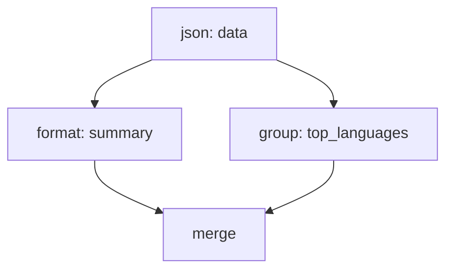
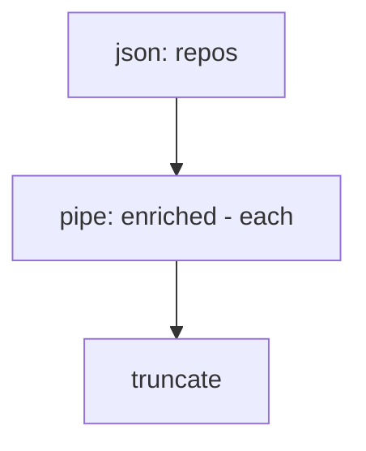
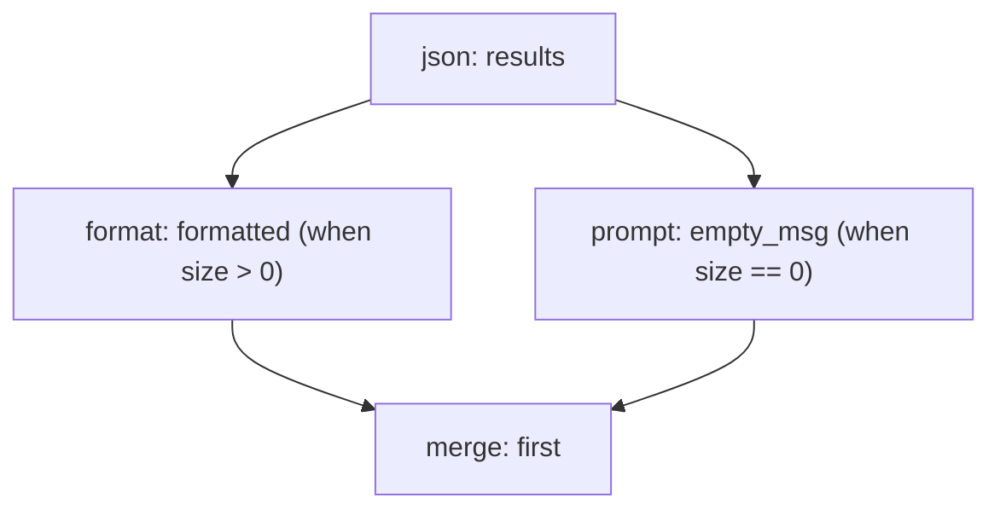
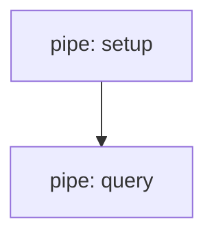
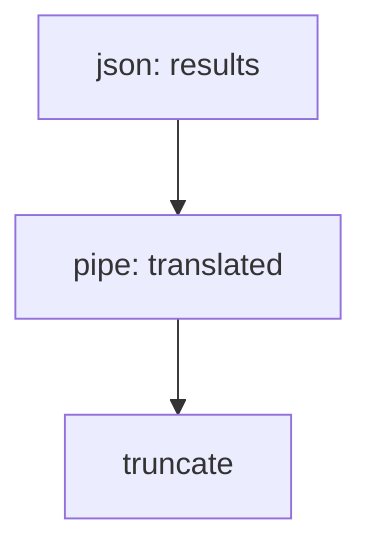

# Transform Guide

Practical cookbook for spec authors. Covers every transform type, common recipes, DAG pipelines, and tips for keeping agent context windows clean.

All examples use spec 1.0 format.

---

## How Transforms Work

### Pipeline model

Transforms are an ordered list of steps. Each step takes the output of the previous step as input, transforms it, and passes the result forward.

```
Raw API response -> Step 1 -> Step 2 -> Step 3 -> Agent sees this
```

Every step has a `type` field that determines what it does. The rest of the fields are type-specific.

```yaml
transform:
  - type: json
    extract: "$.data.items"
  - type: truncate
    max_items: 20
```

Step 1 extracts `data.items` from the response JSON. Step 2 limits the array to 20 items. The agent sees a clean, bounded array.

### Lifecycle phases

Transforms run at three points during action execution:

```
on_request -> Execute action -> on_response -> on_output
```

| Phase | When it runs | Input data | Use case |
|-------|-------------|------------|----------|
| `on_request` | Before the request is sent | Params, headers, body | Rename params, inject defaults, build request bodies |
| `on_response` | After response, before output transforms | Raw response | Validate, log, extract metadata |
| `on_output` | After response transforms (default) | Transformed data | Shape data for the agent |

Most transforms run at `on_output`. You only need the `on` field when targeting a different phase:

```yaml
transform:
  # This runs before the request
  - type: default_params
    on: request
    values:
      format: json

  # These run on the output (default, no `on` needed)
  - type: json
    extract: "$.results"
  - type: truncate
    max_items: 10
```

### Typed model

Every step must have a `type` field. There are no untyped or implicit transforms.

```yaml
# Correct
- type: json
  extract: "$.data"

# Wrong - no type field
- extract: "$.data"
```

---

## Common Recipes

### Recipe: Clean up a REST API response

Strip a verbose API response down to the fields that matter.

**Before** (raw GitHub search response):
```json
{
  "total_count": 1250,
  "incomplete_results": false,
  "items": [
    {
      "id": 123456,
      "node_id": "MDEwOl...",
      "full_name": "owner/repo",
      "private": false,
      "html_url": "https://github.com/owner/repo",
      "description": "A great tool",
      "fork": false,
      "created_at": "2024-01-15T10:30:00Z",
      "updated_at": "2025-03-01T08:00:00Z",
      "stargazers_count": 450,
      "language": "Go",
      "topics": ["cli", "tools"],
      "...": "30+ more fields"
    }
  ]
}
```

**Transform:**
```yaml
transform:
  - type: json
    extract: "$.items"
    select: [full_name, description, language, stargazers_count, created_at]
    rename:
      stargazers_count: stars
      created_at: created
  - type: truncate
    max_items: 20
```

**After:**
```json
[
  {
    "full_name": "owner/repo",
    "description": "A great tool",
    "language": "Go",
    "stars": 450,
    "created": "2024-01-15T10:30:00Z"
  }
]
```

### Recipe: Format as readable text

Turn structured data into human-readable lines. Good for simple lists where JSON is overkill.

**Transform:**
```yaml
transform:
  - type: json
    extract: "$.items"
    select: [full_name, language, stargazers_count]
    rename: { stargazers_count: stars }
  - type: format
    template: "- {full_name} ({language}, {stars} stars)"
```

**After:**
```
- owner/repo (Go, 450 stars)
- other/project (Rust, 1200 stars)
- third/lib (Python, 89 stars)
```

The `format` type uses `{field}` interpolation. For arrays, it produces one line per item joined by newlines.

For more complex output with conditionals and loops, use `template` (Go text/template syntax):

```yaml
transform:
  - type: template
    template: |
      {{range .items}}* {{.full_name}}{{if .language}} [{{.language}}]{{end}} - {{.stars}} stars
      {{end}}
```

### Recipe: HTML docs to markdown

Fetch HTML content (e.g., from a wiki API or docs site) and convert it to clean markdown.

**Transform:**
```yaml
transform:
  - type: json
    extract: "$.parse.text.*"
  - type: html_to_markdown
    remove_images: true
  - type: truncate
    max_length: 6000
```

`html_to_markdown` options:

| Field | Default | Description |
|-------|---------|-------------|
| `remove_images` | `false` | Strip `` tags |
| `remove_links` | `false` | Convert links to plain text |

### Recipe: Sort and filter

Sort results by a field and filter out items that do not meet a threshold.

**Transform:**
```yaml
transform:
  - type: json
    extract: "$.items"
    select: [full_name, stargazers_count, language]
    rename: { stargazers_count: stars }
  - type: filter
    filter: ".stars > 100"
  - type: sort
    field: stars
    order: desc
  - type: truncate
    max_items: 10
```

**Filter expression syntax:** `.field op value`

Supported operators: `>`, `<`, `>=`, `<=`, `==`, `!=`

```yaml
# Numeric comparison
- type: filter
  filter: ".stars > 100"

# String comparison
- type: filter
  filter: ".language == \"Go\""

# Not equal
- type: filter
  filter: ".status != \"archived\""
```

**Sort options:**

| Field | Description |
|-------|-------------|
| `field` | Field name to sort by (supports dotted paths like `owner.login`) |
| `order` | `asc` (default) or `desc` |

Sorting works with both numeric and string values. Numeric comparison is tried first, with string comparison as a fallback.

### Recipe: Deduplicate

Remove duplicate items based on a key field. The first occurrence is kept.

**Transform:**
```yaml
transform:
  - type: json
    extract: "$.results"
  - type: unique
    field: email
```

**Before:**
```json
[
  {"name": "Alice", "email": "alice@example.com"},
  {"name": "Alice (work)", "email": "alice@example.com"},
  {"name": "Bob", "email": "bob@example.com"}
]
```

**After:**
```json
[
  {"name": "Alice", "email": "alice@example.com"},
  {"name": "Bob", "email": "bob@example.com"}
]
```

### Recipe: Group by category

Group an array of objects into a map keyed by a field value.

**Transform:**
```yaml
transform:
  - type: json
    extract: "$.items"
    select: [full_name, language, stargazers_count]
  - type: group
    field: language
```

**After:**
```json
{
  "Go": [
    {"full_name": "owner/repo", "language": "Go", "stargazers_count": 450}
  ],
  "Rust": [
    {"full_name": "other/lib", "language": "Rust", "stargazers_count": 1200},
    {"full_name": "third/crate", "language": "Rust", "stargazers_count": 300}
  ]
}
```

Insertion order is preserved: the first group seen appears first in the output.

### Recipe: Convert XML to JSON

Parse an XML string response into a JSON-compatible structure.

**Transform:**
```yaml
transform:
  - type: xml_to_json
  - type: json
    extract: "$.feed.entry"
    select: [title, link, updated]
```

XML attributes become `@attr` keys. Text content in mixed elements becomes `#text`. Repeated child elements are automatically collected into arrays.

**Input XML:**
```xml
<feed>
  <entry>
    <title>First Post</title>
    <link href="https://example.com/1"/>
    <updated>2025-03-01</updated>
  </entry>
</feed>
```

**After xml_to_json:**
```json
{
  "feed": {
    "entry": {
      "title": "First Post",
      "link": {"@href": "https://example.com/1"},
      "updated": "2025-03-01"
    }
  }
}
```

### Recipe: Convert CSV to JSON

Parse a CSV string into a JSON array. Useful for CLI tools or APIs that return CSV.

**Transform:**
```yaml
transform:
  - type: csv_to_json
    headers: true
  - type: sort
    field: revenue
    order: desc
```

With `headers: true`, the first row becomes field names:

```
name,revenue,region
Acme,50000,US
Globex,75000,EU
```

Becomes:

```json
[
  {"name": "Acme", "revenue": "50000", "region": "US"},
  {"name": "Globex", "revenue": "75000", "region": "EU"}
]
```

With `headers: false` (or omitted), you get an array of arrays:

```json
[
  ["name", "revenue", "region"],
  ["Acme", "50000", "US"]
]
```

### Recipe: Redact sensitive fields

Strip sensitive data before it reaches the agent.

**Transform:**
```yaml
transform:
  - type: redact
    patterns:
      - field: "*.email"
        replace: "[redacted]"
      - field: "*.api_key"
        replace: "[redacted]"
      - field: "*.ssn"
        replace: "[redacted]"
```

The `field` pattern uses glob-style matching. `*.email` matches `email` at any nesting depth.

### Recipe: Chain tools (pipe)

Route transform output through another clictl tool. The piped tool must be listed in the spec's `depends` block.

**Full syntax:**
```yaml
depends:
  - jq

transform:
  - type: pipe
    tool: jq
    action: filter
    params:
      filter: "[.[] | {name, stars: .stargazers_count}]"
```

**Short syntax:**
```yaml
depends:
  - jq

transform:
  - type: pipe
    run: "jq filter --filter '[.[] | select(.stars > 100)]'"
```

The `run` field is a single-line shorthand: `tool action --param value`. The piped tool executes through its own spec, assertions, and sandbox rules.

### Recipe: Pre-request parameter mapping

Rename agent-friendly parameter names to what the API actually expects, and inject default values.

**Transform:**
```yaml
transform:
  # Rename params before the request
  - type: rename_params
    on: request
    map:
      q: query
      limit: per_page

  # Inject defaults for params the agent did not provide
  - type: default_params
    on: request
    values:
      format: json
      per_page: "10"

  # Shape the response
  - type: json
    extract: "$.results"
```

For GraphQL or other APIs that need a structured request body:

```yaml
transform:
  - type: template_body
    on: request
    template: '{"query": "{ search(q: \"{q}\") { id title } }"}'
```

### Recipe: Decode base64 content

Decode base64-encoded content from API responses (e.g., GitHub file contents).

**Decode a specific field:**
```yaml
transform:
  - type: base64_decode
    field: content
```

**Decode the entire response:**
```yaml
transform:
  - type: base64_decode
```

Supports standard, URL-safe, and unpadded base64 encodings. Tries each format automatically.

### Recipe: Reformat dates

Convert date strings from one format to another. Uses Go time layout syntax.

```yaml
transform:
  - type: date_format
    field: created_at
    from: "2006-01-02T15:04:05Z"
    to: "Jan 2, 2006"
```

Common Go layouts:

| Layout | Example |
|--------|---------|
| `2006-01-02T15:04:05Z` | ISO 8601 |
| `Jan 2, 2006` | `Mar 15, 2025` |
| `2006-01-02` | `2025-03-15` |
| `Mon, 02 Jan 2006` | `Sat, 15 Mar 2025` |

Works on single objects and arrays of objects. Only the specified `field` is reformatted.

### Recipe: Count and summarize

Return just the count of items, or join an array into a single string.

**Count:**
```yaml
transform:
  - type: json
    extract: "$.results"
  - type: count
```

Returns a single number (e.g., `42`).

**Join:**
```yaml
transform:
  - type: json
    extract: "$.tags"
  - type: join
    separator: ", "
```

Turns `["go", "cli", "tools"]` into `"go, cli, tools"`. Default separator is `", "`.

**Split:**
```yaml
transform:
  - type: split
    separator: ","
```

Turns `"go,cli,tools"` into `["go", "cli", "tools"]`.

### Recipe: Flatten and unwrap

**Flatten** nested arrays one level deep:

```yaml
transform:
  - type: json
    flatten: true
```

`[[1, 2], [3, 4], 5]` becomes `[1, 2, 3, 4, 5]`.

You can also use the standalone type:

```yaml
- type: flatten
```

**Unwrap** single-item arrays:

```yaml
transform:
  - type: json
    unwrap: true
```

`[{"name": "only-item"}]` becomes `{"name": "only-item"}`. Arrays with 2+ items are left unchanged.

### Recipe: Add context for the agent

Use `prompt` to append agent-facing guidance to the output. The agent sees the data plus the instruction text.

**Unconditional:**
```yaml
transform:
  - type: json
    extract: "$.items"
  - type: prompt
    value: "Results are sorted by relevance. If the user wants popularity, re-run with sort=stars."
```

**Conditional (only when a condition is met):**
```yaml
transform:
  - type: prompt
    when: "size(data) == 0"
    value: "No results found. Try broadening the search or using different keywords."
```

`when` expressions:

| Expression | Description |
|-----------|-------------|
| `size(data) == 0` | Input is empty |
| `size(data) > 100` | Input has many items |
| `data.status == 'error'` | Field equals a value |
| `data.rate_limit_remaining < 100` | Numeric field comparison |

### Recipe: Escape hatch with jq

For complex transformations that declarative types cannot express, use a `jq` expression.

```yaml
transform:
  - type: jq
    filter: "[.items[] | {name: .full_name, stars: .stargazers_count}] | sort_by(-.stars)[:10]"
```

### Recipe: Escape hatch with JavaScript

For logic that needs conditionals, loops, or string manipulation beyond what declarative types offer.

```yaml
transform:
  - type: js
    script: |
      function transform(data) {
        return data
          .filter(r => r.score > 0.5)
          .map(r => ({
            name: r.name,
            score: Math.round(r.score * 100) + "%"
          }));
      }
```

The JS sandbox is restricted: no `fetch`, `eval`, `require`, `setTimeout`, or constructor access.

---

## All Transform Types Reference

### Response transforms (on_output, the default)

| Type | Description | Key fields |
|------|-------------|------------|
| `json` | Extract, select, rename, inject, flatten, unwrap JSON | `extract`, `select`, `rename`, `inject`, `only`, `flatten`, `unwrap`, `default` |
| `truncate` | Limit array length or string length | `max_items`, `max_length` |
| `template` | Go text/template rendering | `template` |
| `format` | Simple `{field}` interpolation, one line per array item | `template` |
| `html_to_markdown` | Convert HTML to markdown | `remove_images`, `remove_links` |
| `markdown_to_text` | Strip markdown formatting to plain text | (none) |
| `sort` | Sort array of objects by field | `field`, `order` |
| `filter` | Filter array items by expression | `filter` |
| `unique` | Deduplicate by field (first occurrence kept) | `field` |
| `group` | Group array into map by field value | `field` |
| `count` | Return count of array items | (none) |
| `join` | Join array of strings into one string | `separator` |
| `split` | Split string into array | `separator` |
| `flatten` | Flatten nested arrays one level | (none) |
| `unwrap` | Unwrap single-item arrays | (none) |
| `prefix` | Prepend text to the output | `value` |
| `prompt` | Append agent guidance text | `value`, `when` |
| `date_format` | Reformat date strings | `field`, `from`, `to` |
| `xml_to_json` | Parse XML string to JSON | (none) |
| `csv_to_json` | Parse CSV string to JSON array | `headers` |
| `base64_decode` | Decode base64 content | `field` (optional) |
| `redact` | Scrub sensitive field values | `patterns` (list of `field` + `replace`) |
| `cost` | Track token/cost usage | `input_tokens`, `output_tokens`, `model` |
| `jq` | jq expression | `filter` |
| `js` | Sandboxed JavaScript | `script` |
| `pipe` | Route through another clictl tool | `tool`+`action`+`params`, or `run` |
| `merge` | Combine outputs from DAG branches | `sources`, `strategy`, `join_on` |

### Pre-request transforms (on: request)

| Type | Description | Key fields |
|------|-------------|------------|
| `rename_params` | Map agent param names to API param names | `map` |
| `default_params` | Inject default param values | `values` |
| `template_body` | Build request body from a template | `template` |

### The `json` type in detail

The `json` type is the workhorse. It combines multiple JSON operations in a single step, applied in this order:

1. `extract` - JSONPath extraction (e.g., `$.data.items`)
2. `only` - Allowlist top-level keys on root object
3. `select` - Keep only listed fields on each object in an array
4. `rename` - Rename fields
5. `inject` - Add default fields to every object
6. `default` - Fill missing fields with default values
7. `flatten` - Flatten nested arrays
8. `unwrap` - Unwrap single-item arrays

```yaml
# All in one step
- type: json
  extract: "$.data.results"
  select: [name, status, url, created_at]
  rename: { created_at: created }
  inject: { source: "my-api" }
  default: { status: "unknown" }
```

JSONPath supports: `$.field`, `$.field.nested`, `$.field[0]`, `$.array[*].field`, `$.field.*`.

---

## DAG Transforms

Linear pipelines (A -> B -> C) handle most use cases. For parallel branches, conditional steps, fan-out, and merging, add DAG fields to your transform steps.

### When to use DAGs

- You need to run two transforms on the same data in parallel and merge the results
- A step should only run when a condition is met
- You want to apply a transform to each item in an array concurrently
- You are building a composite action that calls multiple tools

### How DAG fields work

Any transform step can have these optional fields:

| Field | Type | Description |
|-------|------|-------------|
| `id` | string | Name for this step's output. Required for DAG steps that other steps reference. |
| `input` | string | Which step's output to read from (by `id`). Without this, the step reads from _root (the raw response) or its first dependency. |
| `depends` | list | Steps that must complete first (ordering without data flow). |
| `each` | bool | Fan-out: iterate over input array, run the step once per item. |
| `when` | string | Condition expression. Step only runs if true. |
| `concurrency` | int | Max parallel goroutines for `each` (default: 10). |

Steps without any DAG fields run in linear order, exactly like a regular pipeline. You can mix linear and DAG steps.

### Pattern: Parallel branches

Process the same data two different ways, then merge.

```yaml
transform:
  - id: data
    type: json
    extract: "$.items"
    select: [full_name, description, language, stargazers_count]

  - id: summary
    input: data
    type: format
    template: "- {full_name}: {stargazers_count} stars"

  - id: top_languages
    input: data
    type: group
    field: language

  - type: merge
    sources: [summary, top_languages]
    strategy: object
```



The DAG executor detects that `summary` and `top_languages` are independent (both depend only on `data`) and runs them in parallel.

### Pattern: Fan-out with each

Apply a transform to every item in an array concurrently.

```yaml
transform:
  - id: repos
    type: json
    extract: "$.items"

  - id: enriched
    input: repos
    type: pipe
    run: "github get_repo --owner {owner} --repo {name}"
    each: true
    concurrency: 5

  - type: truncate
    input: enriched
    max_items: 10
```



With `each: true`, the step receives each array element individually and collects results back into an array. `concurrency` limits parallel execution (default 10).

### Pattern: Conditional steps with when

Run a step only when a condition is met.

```yaml
transform:
  - id: results
    type: json
    extract: "$.items"

  - id: formatted
    input: results
    type: format
    template: "- {name}: {stars} stars"
    when: "size(data) > 0"

  - id: empty_msg
    type: prompt
    value: "No results found. Try a broader search query."
    when: "size(data) == 0"

  - type: merge
    sources: [formatted, empty_msg]
    strategy: first
```



The `first` merge strategy returns whichever branch produced a non-null result.

**Supported `when` expressions:**

| Expression | Description |
|-----------|-------------|
| `size(data) == N` | Array/map/string length equals N |
| `size(data) > N` | Length greater than N |
| `size(data) < N` | Length less than N |
| `data.field == 'value'` | Field string comparison |
| `data.field != 'value'` | Field not-equal comparison |

### Pattern: Merge strategies

The `merge` type combines outputs from multiple branches.

| Strategy | Description | Example use case |
|----------|-------------|------------------|
| `concat` | Concatenate arrays into one | Combine results from multiple API calls |
| `zip` | Pair elements by index | Match original items with enrichment data |
| `first` | Return first non-null source | Conditional branches (one will be null) |
| `join` | Join objects by shared key (like SQL JOIN) | Enrich records from a second data source |
| `object` | Combine into one map keyed by source ID | Return structured output with named sections |

**concat** (default):
```yaml
- type: merge
  sources: [branch_a, branch_b]
  strategy: concat
```
`[1, 2]` + `[3, 4]` = `[1, 2, 3, 4]`

**zip:**
```yaml
- type: merge
  sources: [names, scores]
  strategy: zip
```
`["Alice", "Bob"]` + `[95, 87]` = `[["Alice", 95], ["Bob", 87]]`

**join:**
```yaml
- type: merge
  sources: [users, orders]
  strategy: join
  join_on: user_id
```
Merges fields from `orders` into matching `users` records by `user_id`.

**object:**
```yaml
- type: merge
  sources: [summary, details]
  strategy: object
```
Result: `{"summary": [...], "details": [...]}`

### Pattern: Ordering without data flow

Use `depends` when a step must wait for another to complete but does not consume its output.

```yaml
transform:
  - id: setup
    type: pipe
    run: "cache warm --key results"

  - id: query
    type: pipe
    run: "database query --sql 'SELECT * FROM results'"
    depends: [setup]
```



`query` waits for `setup` to finish, but reads from `_root` (the original input), not from `setup`'s output.

### Pattern: Multi-tool composite action

A complete example combining pipe, DAG, and merge to build a composite action.

```yaml
spec: "1.0"
name: repo-dashboard
description: Search repos and enrich with translation
version: "1.0"
category: developer
tags: [github, translate]

depends:
  - deepl

server:
  type: http
  url: https://api.github.com

auth:
  env: GITHUB_TOKEN
  header: Authorization
  value: "Bearer ${GITHUB_TOKEN}"

actions:
  - name: search_and_translate
    description: Search repos and translate descriptions
    path: /search/repositories
    params:
      - name: q
        required: true
    transform:
      - id: results
        type: json
        extract: "$.items"
        select: [full_name, description]

      - id: translated
        input: results
        type: pipe
        run: "deepl translate --target_lang DE"

      - type: truncate
        input: translated
        max_items: 5
```



---

## MCP Action Transforms

For MCP servers, transforms are keyed by action name in a top-level `transforms` block (not inside individual actions):

```yaml
transforms:
  read_file:
    - type: truncate
      max_length: 8000
  list_directory:
    - type: truncate
      max_items: 100
  "*":
    - type: truncate
      max_length: 16000
```

The `"*"` key is a wildcard default applied to any action without a specific transform entry.

---

## Tips

### Always truncate

Every spec that returns variable-length data should end with a `truncate` step. Agent context windows are finite and expensive. A 200-item JSON array wastes tokens and may cause the agent to lose track of its task.

```yaml
# Good: bounded output
- type: truncate
  max_items: 20
  max_length: 8000

# Bad: unbounded output goes straight to the agent
```

### Combine JSON operations

The `json` type can do extract + select + rename + inject + default + flatten + unwrap in one step. Do not split these into separate steps unless you need a different transform type in between.

```yaml
# Good: one step
- type: json
  extract: "$.data.items"
  select: [name, status]
  rename: { created_at: created }

# Unnecessary: three steps for what one can do
- type: json
  extract: "$.data.items"
- type: json
  select: [name, status]
- type: json
  rename: { created_at: created }
```

### Use format for simple output, template for complex

`format` uses `{field}` interpolation and produces one line per array item. It is clean and predictable.

`template` uses Go text/template and supports conditionals, loops, and nested access. Use it when `format` is not enough.

```yaml
# format: simple, one line per item
- type: format
  template: "- {name} ({language})"

# template: conditionals, loops, nested fields
- type: template
  template: |
    {{range .}}{{.name}}{{if .language}} [{{.language}}]{{end}}
    {{end}}
```

### Use pipe for anything built-in transforms cannot do

If you need to call `jq` with complex expressions, translate text, or run any other clictl tool on the data, use `pipe`. The tool must be in `depends`.

### Test transforms locally

```bash
clictl transform --file transforms.yaml
```

This runs your transform pipeline against sample data without making a real API call, so you can iterate quickly.

### Prefer declarative types over jq/js

Declarative types (`json`, `sort`, `filter`, `truncate`, `format`) are easier to read, validate, and optimize. Reserve `jq` and `js` for cases where no declarative type fits.

### Pre-request transforms run in a different context

Pre-request transforms (`on: request`) operate on the request parameters, not on response data. Do not mix response transforms with `on: request`. The phases are separate pipelines.

### Order matters in linear pipelines

Steps execute top to bottom. If you filter before truncating, you get the top N from filtered results. If you truncate before filtering, you filter only the first N items. Think about the order carefully.

```yaml
# Filter first, then take top 10
- type: filter
  filter: ".stars > 100"
- type: sort
  field: stars
  order: desc
- type: truncate
  max_items: 10
```
